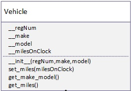
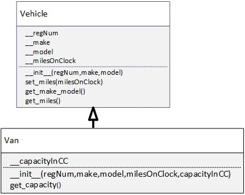

# Vehicle And Van UML Classes Example

When designing larger systems it is often necessary to assign the implementation of different components to different individual programmmers or programming teams. 

If those programmers or teams do not follow the design specification precisely the resultant components/modules will not be able to talk to each other/pass messages to each other and the system will not work

Note in this assignment snake_case is used for method names. Sometimes in specifications camelCase case is used. The style used often depends on the background of the programmer who wrote the UML spec but snake_case is common among python programmers.

The following assignment has two objectives
- To ensure you can follow a UML specivication precisely to create the class that is described
- To ensure you can follow a UML specification to create a super class i.e. a class that inherits from the base class or subclass

# Part 1
Create the classes as described in the UML diagram for the Vehicle Object

Follow the names of the classes, attributes and methods exactly as in the diagram
Test your classes to see if they work
If they don't work it is because you have not followed the specification precisely

# Part 2
Create the Van class as it is described in the following diagram

